# MineOps-api

## About

MineOps, the simplest way to provision and manage asic miners for multiple clients. 

## Requirements

- nodejs
- mongo
- raspberry PI or better
- git 


### Installation

Prior to starting – please make sure the file dcs_root.json has been properly configured. see Appendix

Install
- nodejs
- mongodb (run as a service. install tools as well)
- pm2 (*suggested) 

Create database &quot;mineops_local&quot;
open mongodb shell 
```bash
mongo
```

create database
```bash
use mineops_local
```

close mongo shell
```bash
exit
```

checkout source and install
dependencies and required directories
```bash
npm i
mkdir tmp
```

import dataCenterSettings (Copy dcs_root.json and edit the properties or you will have to edit directly
in mongo)
```bash
cd mineops/data
mongoimport -c dataCenterSettings -d mineops_local --file dcs_root.json
```

Go to mineops root and start using npm
```bash
cd .. 
npm start
```

or run in the background with pm2
```bash
pm2 start npm --name "mineops" -- start
pm2 save
pm2 logs --out
```


## Usage

### Create an account
* Open localhost:3000 in your browser.
* Click sign up link on the login page.
* Enter email, password and,...
   * a comma delimited list of account names that will be used by this user on pools as well as be visible in the miner list pages when they login.

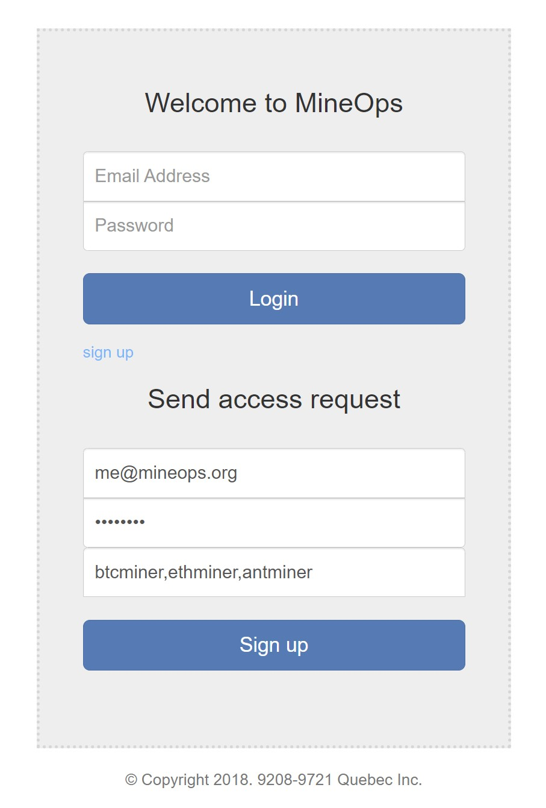


Once set, this needs to be edited directly in 

```bash
nano ~/mineops/server/db.json
```

```json
"User": {
  "2": "{\"password\":\"$2a$10$rmYddZEvj3KZerAugYA/fu76UUMMzOBD8hibnCIxFPFHL5sr4QDV.\",\"validated\":true,\"group\":\"user\",\"email\":\"me@mineops.org\",\"accountName\":\"btcminer,ethminer,antminer\",\"id\":2}",
},
```

Important properties in the above snippet
- Set "validated" = true to activate the account
- Set "group" = "admin" to see all discovered miners 

Discover miners
- login
- navigate to list drop down and select list

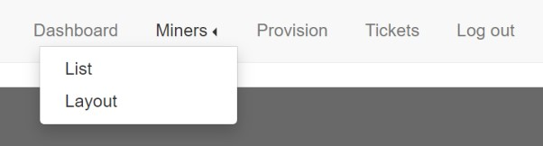


- click on the discover button (Can take a few minutes depending on the network size)

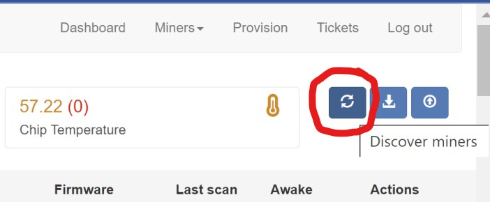

- Refresh the page to see the miners
- If the networkScanInterval is set then these machines are now being monitored
- Let us know if a machine is missing. 

You can use the api to verify that a missing miner is accessible
```
http://localhost:3000/state-check?ipAddress=192.168.1.160
```

## Features
### Consumption filtering
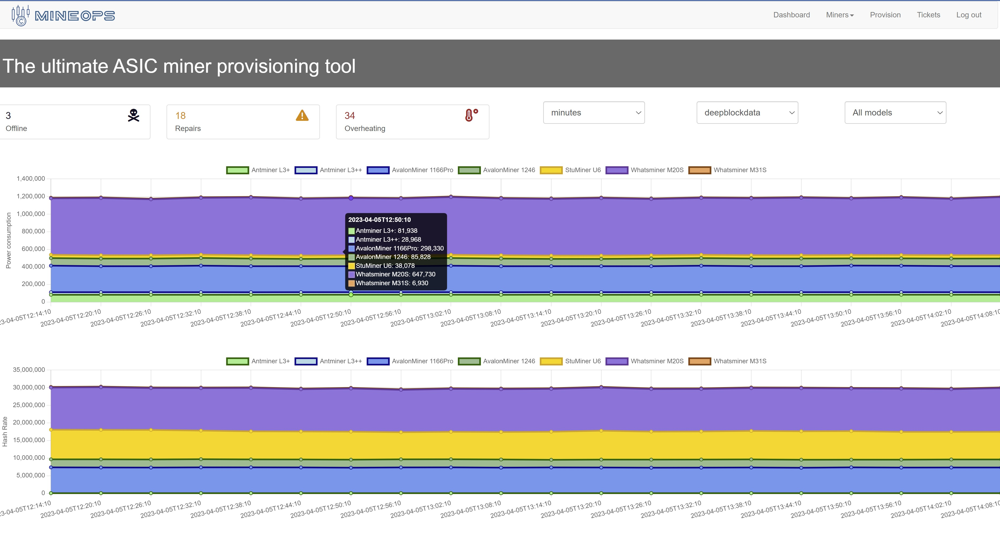

Use this page to:
- Monitor consumption and hashrate
- Filter monitoring by account name or machine type


### Upload property edits
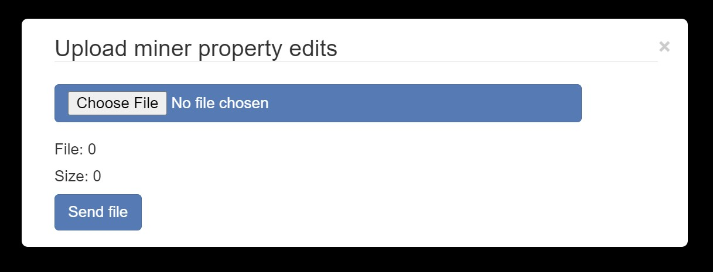

Use this page to:
- Upload miner properties. Usually to patch positions or add serial numbers


### Bulk updates 
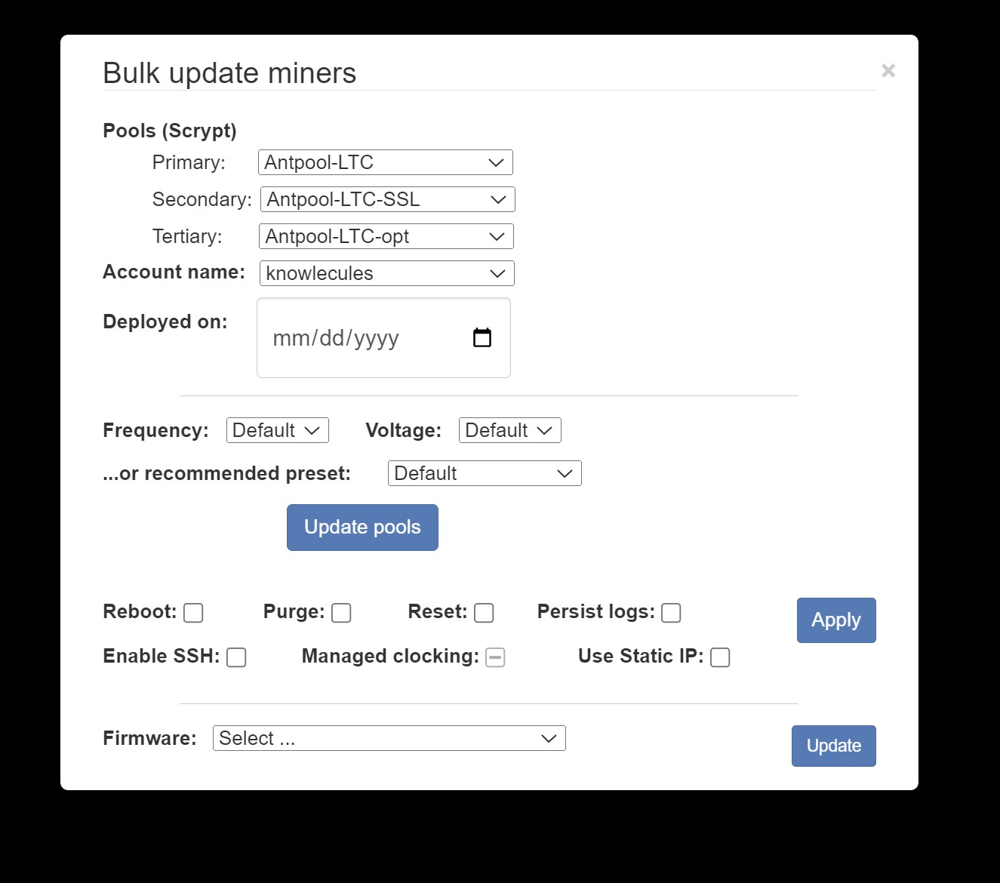

Use this page to perform bulk actions:
- Update pools
- Reboot
- Update firmware (Requires downloading files to another repo and then configuring)
- Remove from database
- Set deployment date


### Active provisioning
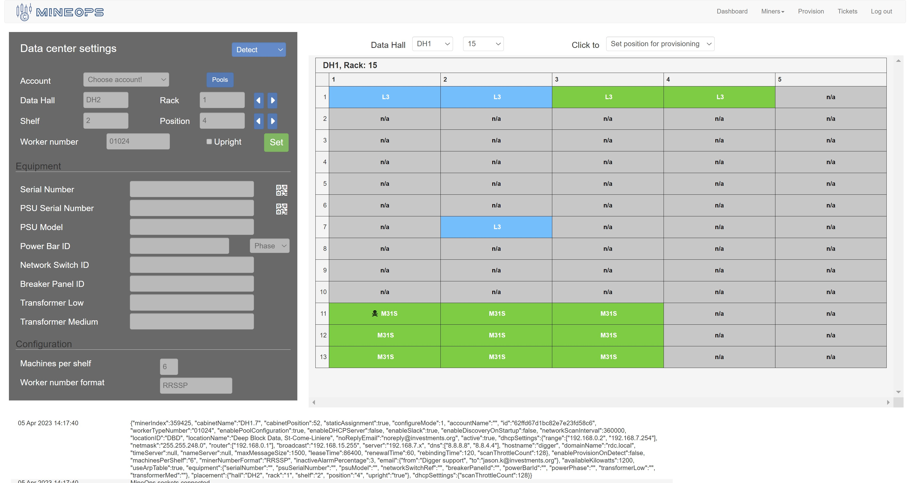

Use this page to:
- Provision miners
- locate miners
- change location of miner

### Miner monitoring 
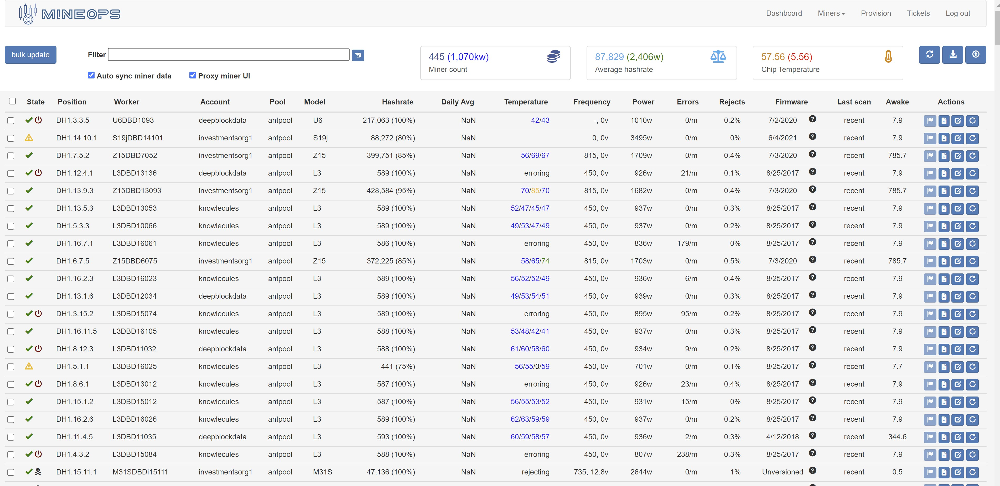

Use this page to:
- see miner state
- sort using menu
- locate poorly performing machines
- navigate to machine directly or using reverse proxy server
- reboot machine
- see machine's logs
- Export miner properties and reupload them
- edit worker name (click)

### Miner filtering
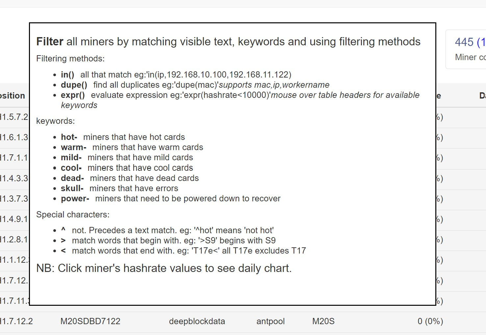

Use this page to:
- Group machines of interest for bulk operations
- Typical filter strings
  - ^recent (show miners that failed during scan)
  - L3 expr(hashrate&lt;400) (show l3s that are not performing well)


### Miner layout view
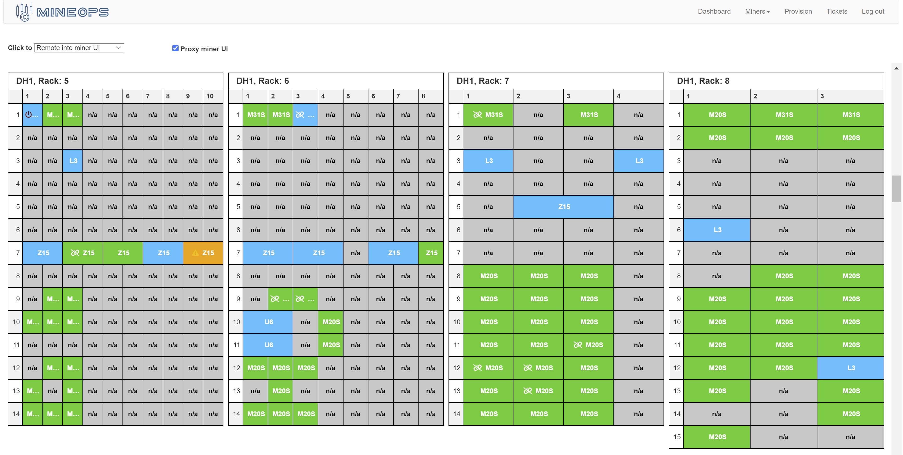

Use this page to:
- Group machines of interest for bulk operations

### Daily hashrate chart 
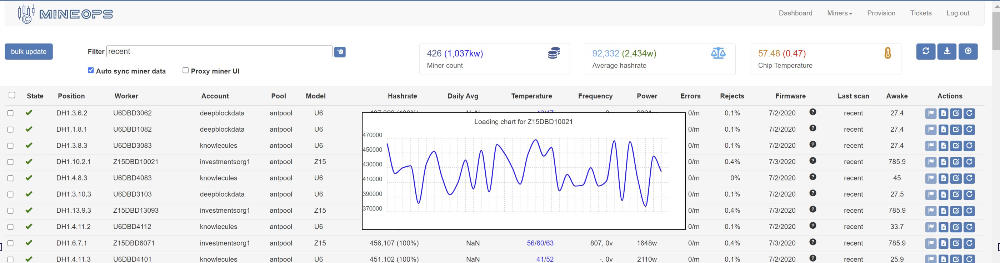


## Appendix

### dataCenterSettings document 
Sample to add to mongo. Edit dhcp settings 

Import properties
- setting networkScanInterval = 0 will disable scanning and associated auto features such as reboots etc... 
- netmask must fit IP range

```json
{
    "minerIndex" : 356262,
    "cabinetName" : "DH1.7",
    "cabinetPosition" : 52,
    "workerTypeNumber" : "07052",
    "staticAssignment" : true,
    "configureMode" : 1,
    "accountName" : "mineops",
    "enablePoolConfiguration" : true,
    "enableDHCPServer" : false,
    "enableSlack" : true,
    "enableDiscoveryOnStartup" : false,
    "networkScanInterval" : 300000,
    "locationID" : "DBD",
    "locationName" : "Deep Block Data, St-Just",
    "noReplyEmail" : "noreply@mineops.org",
    "active" : true,
    "dhcpSettings" : {
            "range" : [
                    "192.168.0.2",
                    "192.168.7.253"
            ],
            "netmask" : "255.255.248.0",
            "router" : [
                    "192.168.0.1"
            ],
            "broadcast" : "192.168.15.255",
            "server" : "192.168.7.x",
            "dns" : [
                    "8.8.8.8",
                    "8.8.4.4"
            ],
            "hostname" : "mineops",
            "domainName" : "rdc.local",
            "timeServer" : null,
            "nameServer" : null,
            "maxMessageSize" : 1500,
            "leaseTime" : 86400,
            "renewalTime" : 60,
            "rebindingTime" : 120,
            "scanThrottleCount" : 200
    },
    "enableProvisionOnDetect" : true,
    "machinesPerShelf" : "6",
    "minerNumberFormat" : "RRSSP",
    "inactiveAlarmPercentage" : 3,
    "email" : {
            "from" : "Mineops support<support@mineops.org>",
            "to" : "jason.k@mineops.org"
    },
    "availableKilowatts" : 1200
}

```

* To debug in Visual Studio Code:
  * Select the Debug MineOps configuration (default configuration) then press F5.
  * To debug with hot reloading, select the Debug MineOps (Hot Reload) configuration then press F5.
* To debug in Chrome/Brave, from the command line at the root of the application, run `node --inspect-brk app.js`. Once running, the terminal should have an output similar to this.

```text
Debugger listening on port 9229.
Warning: This is an experimental feature and could change at any time.
To start debugging, open the following URL in Chrome:
    chrome-devtools://devtools/bundled/inspector.html?experiments=true&v8only=true&ws=127.0.0.1:9229/bfd80bfb-65e3-4a03-bb44-092dff9e3da7
```

Paste the URL provide in the terminal, e.g. `chrome-devtools://devtools/bundled/inspector.html?experiments=true&v8only=true&ws=127.0.0.1:9229/bfd80bfb-65e3-4a03-bb44-092dff9e3da7` and paste it into the address bar in Chrome/Brave. From there you will be able to debug the application.

### Troubleshooting

* If you have issues with precommit scripts nochrome-devtools://devtools/bundled/inspector.html?experiments=true&v8only=true&ws=127.0.0.1:9229/bfd80bfb-65e3-4a03-bb44-092dff9e3da7t running, it's most likely because you reinstalled your packages and npm reinstalled from its cache. When you reinstall from the cache, post install scripts of packages do not reinstall. To fix this, delete your `node_modules` folder then run `npm install --no-cache`.# My Application

The project is generated by [LoopBack](http://loopback.io).

### .env
```bash
NODE_DEBUG=proxy
smtpTransport={"service": "Gmail","auth": {"user": "username@gmail.com", "pass": "Pa55w0rd"}}
NODE_ENV=
DISABLE_CONSOLE_METHODS=trace,info
CONSOLE_METHODS_FILTER={"debug":{"key":"logType", "matchText":"_trace", "method":"log"}} 
LOG_LEVEL_OPTIONS= ERROR, WARNING, LOG, INFO, DEBUG, ALL
LOG_LEVEL=INFO
MESSAGE_SERVICES=
_NETWORK_DIAGNOSTIC={"type":"ping", "ipAddress":"8.8.8.8"}
_MONGO_URL=mongodb+srv://mineops_admin:secretKey.mongodb.net/mineopsCentral?retryWrites=true&w=majority
DEBUG=loopback:zzzdatasource
UNSAFE_EDITS=true;  
```